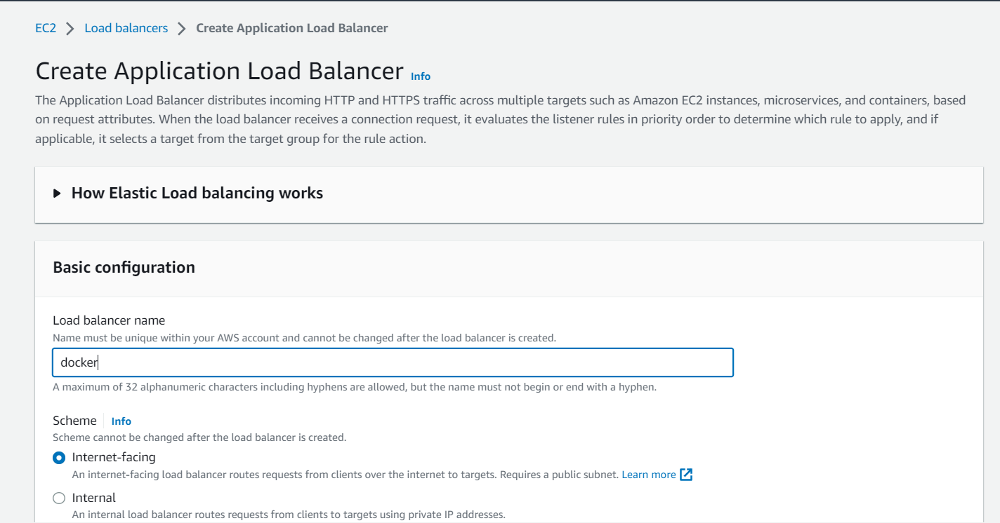
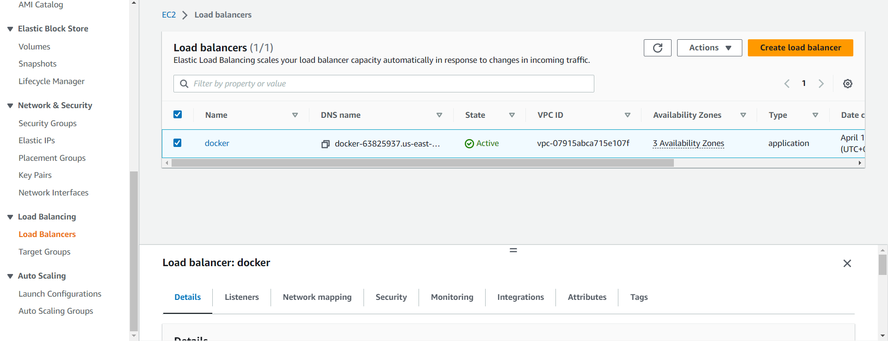

# docker-wordpress


## WordPress Application on Docker ,with phpMyAdmin,R53,Application Load Balancer & AWS Certificate Manager

### Why run Wordpress in Docker?
Running WordPress typically involves installing a LAMP (Linux, Apache, MySQL, and PHP) or LEMP (Linux, Nginx, MySQL, and PHP) stack, which can be time-consuming. However, by using tools like Docker and Docker Compose, you can streamline the process of setting up your preferred stack and installing WordPress

### Step 1: To launch an instance

Create your EC2 resources and launch your EC2 instance


### Connect to instance via SSH client


##### Instance ID
 ``` i-025b81ada889226ff ``` (wordpress-docker)
1. Open an SSH client.
2. Locate your private key file. The key used to launch this instance is adp.pem
3. Run this command, if necessary, to ensure your key is not publicly viewable.
```
            chmod 400 adp.pem
```
4. Connect to your instance using its Public DNS:

```
            ec2-65-2-123-63.ap-south-1.compute.amazonaws.com
```

##### Example:
```
            ssh -i "adp.pem" ubuntu@ec2-65-2-123-63.ap-south-1.compute.amazonaws.com
```


### Step2: Connect to your Linux instance using SSH


I have added ssh **private key** (adp.pem) in assests directory

### Step 3: Check the OS Version
```
cat /etc/*release*
```


### Step 4 : Install Docker Engine on Ubuntu with help of script file

```
curl -fsSL https://get.docker.com -o get-docker.sh
sudo sh get-docker.sh
```


#####  NOTE "Please wait few minutes after run the script"

## check docker version

```
docker version
```


## Step 5:  Install Docker Compose on Ubuntu 20.04

```
sudo curl -L "https://github.com/docker/compose/releases/download/1.29.2/docker-compose-$(uname -s)-$(uname -m)" -o /usr/local/bin/docker-compose

sudo chmod +x /usr/local/bin/docker-compose
```


## Check the docker compose version

```
docker-compose --version
```


## Step 6: Compose file build

```
git clone https://github.com/shabbiryahya/WordPress-Application-on-Docker.git
```


```
 cd WordPress-Application-on-Docker
```


Environment file -> .env_password

### build the docker images with help of docker-compose file

```
sudo docker-compose up --build -d
```


### How to find Docker images

```
sudo docker images
```


### List of running docker container

```
sudo docker ps 
sudo docker-compose ps
```


## Step 7 Connect to MySQL running in Docker container

```
sudo docker exec -it mysql_db_conatiner /bin/bash
```


```
 mysql -u root -p
```


#### Accessing a wordpress website container

```
sudo docker-compose ps
```


paste the public ip and port number  
public ip - http://52.66.124.163 
port number - 80  
http://52.66.124.163:80  


## Step 8: Check Wordpress application connected or not with MYSQL database

IP Address:Port number
http://52.66.124.163:8080


for credential goto ```.env_password``` -> ```# wordpress```


## Step 9: Create two target group


- everything is default and you will create first group & same second target group you will create only change port number and target group name  
- first target group name is docker-1 and port number is 80  
- second target group name is docker-2 and port number is 8080  


## Step10 : Create Application Load Balancer



## select all subnet


## select the docker-1 target group





